# Maternal and Perinatal Death Surveillance and Response - System Design Guide { #rmncah-mpdsr-design }

## Introduction

The **Maternal and Perinatal Death Surveillance and Response (MPDSR) Toolkit for DHIS2** has been developed in collaboration with **UNFPA** to strengthen the collection, analysis, and use of data for reducing preventable maternal, stillbirth, and neonatal deaths.

The toolkit is based on the **WHO publication “Maternal and Perinatal Death Surveillance and Response: Materials to Support Implementation” (2021)** and provides a standardized DHIS2 configuration that digitizes key tools and processes of the MPDSR cycle. It enables countries to establish or enhance national MPDSR systems that promote continuous learning, accountability, and quality improvement in maternal and newborn care.

The **DHIS2 MPDSR Toolkit** translates the global MPDSR framework into a digital solution that integrates with existing national Health Management Information Systems (HMIS). It supports the identification, review, and response to deaths, ensuring that findings and lessons learned are systematically captured, analyzed, and acted upon at all levels of the health system.

The toolkit aligns with:

- **WHO MPDSR implementation materials and annexes**, which define standardized processes, tools, and indicators
- **UNFPA’s guidance** on strengthening national MPDSR mechanisms within routine health information systems
- **DHIS2 design principles** emphasizing interoperability, simplicity, and adaptability to country contexts.

The System Design Guide describes the functional configuration of the toolkit, including:

- Data models and forms
- Indicator definitions and calculation logic
- Dashboard structure and visualization design

Reference metadata for the toolkit will be made available at **dhis2.org/metadata-downloads**.

## Acknowledgements

The **MPDSR Toolkit** has been developed **in collaboration with UNFPA**. We thank UNFPA for its leadership and technical collaboration in the design and development of this toolkit, as well as for its continued commitment to strengthening maternal and newborn health information systems.

## System Design Overview

### Background

Despite global commitments to end preventable maternal and newborn deaths, progress towards the **SDG targets**—reducing the global maternal mortality ratio to less than 70 per 100,000 live births and ending preventable stillbirths and neonatal deaths by 2030—remains uneven. Many countries continue to experience preventable deaths due to delays in recognizing complications, accessing timely care, and gaps in health service provision. .

The **MPDSR approach**, led by WHO and partners, provides a continuous cycle to identify, notify, review, analyze, and respond to every maternal and perinatal death. It aims to transform individual tragedies into opportunities for systemic improvement through evidence-based action. MPDSR systems constitute a form of continuous surveillance linking health information systems with quality of care and referral improvement processes from local to national levels. Through the identification of critical failures in the care pathway, it helps in taking timely actions to prevent similar deaths from occurring in the future.

However, in many settings, MPDSR implementation remains fragmented. Paper-based reporting and limited data feedback loops often result in incomplete information, missed follow-up actions, and weak accountability. Integration of MPDSR into routine information systems is essential to ensure that every death is counted, every review is completed, and every recommendation leads to measurable change.

To address these challenges, **UNFPA and WHO** have developed the **DHIS2 MPDSR Toolkit** to digitize and harmonize MPDSR tools within national DHIS2 platforms. The toolkit converts the core MPDSR instruments—such as the **Situation Mapping Tool**, **Maternal Death Case Review Form**, and **Stillbirth and Neonatal Death Case Review Form** into interoperable digital components.

This digital approach enhances efficiency, timeliness, and data use by:

- Enabling real-time case notification and review tracking
- Linking individual death reviews with aggregate monitoring indicators
- Supporting visualization of patterns and modifiable factors
- Strengthening accountability and response through structured feedback mechanisms.

The toolkit provides a cost-effective and scalable solution that leverages DHIS2’s strengths in data capture, validation, and visualization to institutionalize MPDSR as a routine component of health information systems.

### Use Case

The **DHIS2 MPDSR Toolkit** is designed to support the full implementation of MPDSR across health facilities and administrative levels, enabling **Ministries of Health** and partners to institutionalize continuous surveillance and response for maternal and perinatal deaths.

It supports the systematic documentation, review, and analysis of data through the following components:

- **Event Program**: used to assess readiness, committee functionality, and reporting mechanisms.
- **Tracker Programs**:
    - Detailed documentation of maternal deaths, clinical events, contributing factors, and recommended actions.
    - Perinatal deaths, including classification of causes, quality of care assessments, and modifiable factors.
- **Dataset**: Supporting routine reporting of key MPDSR indicators and feeding aggregated data into the dashboards.
- **Dashboards**:
    - _Facility Dashboard_ for MPDSR committees to monitor reported cases, review meetings, and follow-up actions.
    - _Subnational/National Dashboard_ for higher-level users to track trends, causes, and performance indicators across facilities and districts.

The toolkit supports **case-based data entry** and **aggregate reporting** at facility level. Data are analyzed through built-in indicators and visualized in preconfigured dashboards to provide actionable insights for decision-making and supervision.

Unlike clinical case management systems, the MPDSR Toolkit is designed for **public health surveillance and system improvement**. It captures de-identified data, promotes a **no-blame culture**, and emphasizes collective learning and accountability.

The toolkit can be implemented as a **stand-alone DHIS2 module** or integrated into national HMIS platforms. By digitizing MPDSR processes, it enables countries to transition from ad hoc, paper-based reviews to a **routine, standardized, and data-driven system**, strengthening the use of evidence to prevent future maternal and perinatal deaths.

#### Intended users

The **MPDSR DHIS2 Toolkit** is designed to meet the needs of programme managers, health information officers, technical teams, and health workers responsible for implementing, monitoring, and strengthening maternal and perinatal death surveillance and response across all levels of the health system.

It supports both **data entry** (case reporting and review documentation) and **data use** (analysis, visualization, and follow-up of response actions), ensuring that information on maternal, stillbirth, and neonatal deaths is routinely captured, reviewed, and acted upon.

Intended users include:

- **Maternal and Newborn Health (MNH) and MPDSR programme managers (national and subnational levels):** Primary data users responsible for reviewing and interpreting MPDSR indicators to monitor deaths, identify modifiable factors, and track implementation of response actions. They use MPDSR dashboards to guide performance reviews, planning, and supervision, and to coordinate quality improvement interventions.
- **Health Management Information System (HMIS) and Monitoring & Evaluation (M&E) officers:** Users who oversee data collection, validation, and reporting processes for MPDSR indicators within the national health information system. They ensure completeness, accuracy, and consistency of MPDSR data, facilitate data flow from facilities to higher levels, and support regular review and feedback mechanisms.
- **System administrators and DHIS2 focal points:** Technical users responsible for configuring, maintaining, and adapting the MPDSR module within DHIS2. They manage user roles and permissions, ensure metadata alignment with other DHIS2 domains (such as HMIS, CRVS, or maternal health), and provide user support, troubleshooting, and technical maintenance.
- **Facility-level staff and MPDSR committee members:** Health workers and supervisors at facilities responsible for entering MPDSR data, conducting case reviews, and tracking follow-up actions. Depending on national workflows, they may enter data directly into DHIS2 tracker forms or from completed paper-based review tools. They are key actors in ensuring timely notification, documentation, and response at the facility level.
- **Implementing and technical partners:** Organizations supporting Ministries of Health in the implementation of MPDSR and related maternal and newborn health programmes. These partners may assist with capacity building, localization and rollout of the toolkit, system integration, and analysis of aggregated data for programme planning and policy dialogue.

### Design structure

The **DHIS2 MPDSR Toolkit** is composed of five main components that together enable comprehensive surveillance, review, and response to maternal, stillbirth, and neonatal deaths. These components form an integrated digital system that operationalizes the full MPDSR cycle—**identify, notify, review, analyze, and respond**—within the national health information ecosystem.

The **Situation Mapping Event Program** captures information on the readiness and functionality of MPDSR systems at facility and district levels. It records the existence and performance of committees, frequency of meetings, and availability of reporting mechanisms. This program supports periodic self-assessments, enabling health facilities and administrative units to monitor system performance and identify areas requiring improvement over time.

The **Maternal Death Case Review Tracker Program** enables structured documentation of each maternal death from notification to review and follow-up. It supports systematic case analysis by recording the key circumstances of each death, contributing and modifiable factors, and the actions decided by review committees. The program facilitates accountability and learning by ensuring that findings and actions are documented consistently and monitored over time.

The **Stillbirth and Neonatal Death Case Review Tracker Program** documents perinatal and neonatal deaths in a standardized digital format. It captures information on the circumstances of each death and related quality-of-care factors, supporting a unified approach to learning from all maternal and perinatal deaths within the same system.

The **MPDSR Dataset** complements these case-based tools by sustaining the analytics and visualizations presented in the dashboards. It is not designed for direct reporting but rather to aggregate and organize the data required for standardized charts, tables, and summaries that support performance monitoring and analysis.

Finally, the toolkit includes **two preconfigured dashboards**, designed to provide clear and actionable insights at different levels of the health system. The **Facility Dashboard** supports local MPDSR committees and managers in tracking processes and follow-up actions, while the **Subnational and National Dashboard** offers programme managers an overview of trends, system functionality, and progress in MPDSR implementation. Together, these dashboards support evidence-based decision-making and promote a culture of accountability and continuous improvement.

All components are aligned with the global MPDSR framework and DHIS2 design principles, ensuring interoperability, consistency, and adaptability to national contexts. The configuration facilitates a continuous flow of information from facilities to national level and back, strengthening data-driven action and learning across the health system.

## Situation Mapping Event Program

The **Situation Mapping Event Program** is designed to capture information on the readiness and functionality of the MPDSR system at health facility and administrative levels. It provides a structured approach for assessing whether the necessary elements for effective MPDSR implementation are in place and functioning as intended.

This program is typically completed once or twice per year by MPDSR focal points, facility managers, or district supervisors. It is used to assess the operational status of the MPDSR process, including committee functionality, frequency of review meetings, reporting mechanisms, documentation practices, and the integration of MPDSR findings into quality improvement activities. The results inform local and national stakeholders on progress made, existing challenges, and areas that require support.

The **information collected** focuses on the presence, functionality, and coordination of the core elements that enable the MPDSR system to operate effectively. These elements include various committees or teams (such as quality improvement and death review groups), data management and reporting structures, supervision and feedback mechanisms, and resource availability.

The program is **organized by element**, meaning that each component of the MPDSR system—such as a committee, team, or operational structure—is represented as a separate section. For each element, the user is first asked whether it exists or is functional. If the element is confirmed as present, additional fields appear to capture related information, such as the main person or position responsible, the frequency of meetings, or the availability of documentation like registers and minutes.

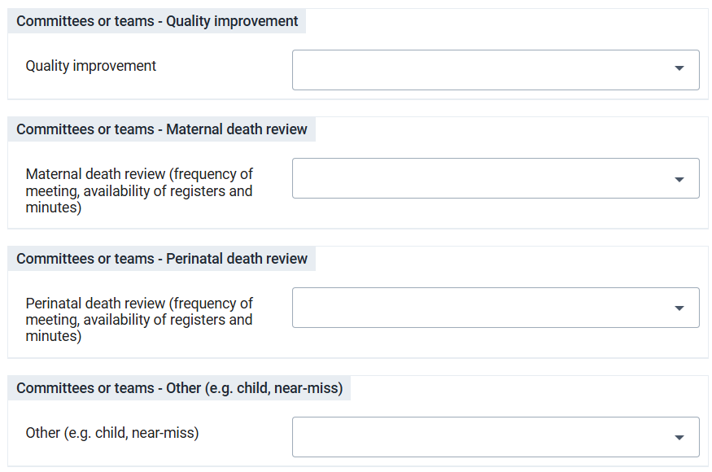

This **dynamic structure** is achieved through the use of **program rules**, which control the visibility of certain fields based on user responses. This ensures that only relevant questions are displayed, reducing data entry burden and improving accuracy. For example, if a facility reports that a maternal death review committee exists, the system automatically prompts for more detailed information about its activities.

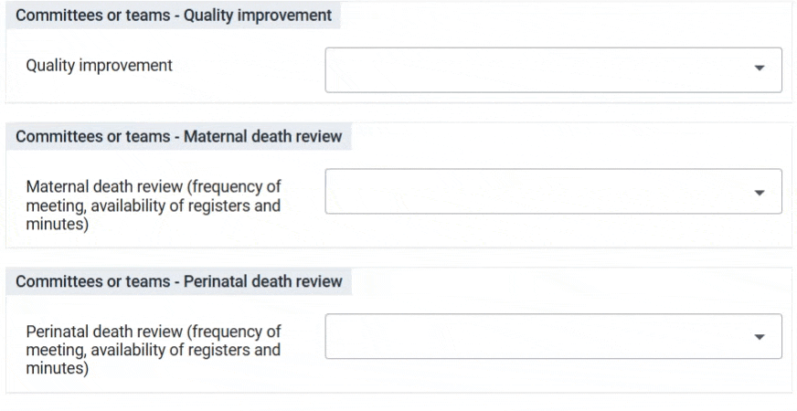

The resulting data provide a comprehensive overview of the operational status of MPDSR structures and processes across health facilities. When visualized in the dashboards, these data help managers identify areas where MPDSR is functional, where support is needed, and how readiness evolves over time. The program therefore serves as a practical tool for strengthening system accountability and guiding targeted quality improvement actions.

## Maternal Death Case Review Tracker Program

The **Maternal Death Case Review Tracker Program** is designed to capture detailed information on every maternal death from notification to review and follow-up. It supports systematic documentation and analysis of individual cases, ensuring that each death is reviewed, the contributing factors are identified, and appropriate response actions are recorded and tracked.

### Enrollment

The **Enrollment Section** initiates the _Maternal Death Case Review Tracker Program_ and corresponds to the registration of each new maternal death in the system. It captures essential identification and contextual information required to uniquely record the case and link it to the facility and reporting pathway.

This section includes the **date of enrollment**, which reflects the moment the case is first entered into DHIS2, and a **unique identifier** that is automatically generated according to a predefined pattern. This ensures standardization and traceability across all records.

Information captured at enrollment includes the **name of the deceased woman**, the **facility or location where the death was reported**, and the **type of care available** at that facility—such as _Comprehensive EmONC_, _Basic EmONC_, or _First Aid level_. These data define the level of service context in which the death occurred.

Referral details are also documented. The user indicates whether the woman was **referred from another facility**, and if so, identifies the **referring site** within the organizational hierarchy. This information supports analysis of referral pathways and inter-facility coordination.

The **Enrollment Section** therefore establishes the foundation for all subsequent documentation and analysis within the tracker. By capturing clear identification, facility context, and referral details at the start, it ensures that each maternal death is uniquely registered, correctly categorized, and traceable through the full review and follow-up process.

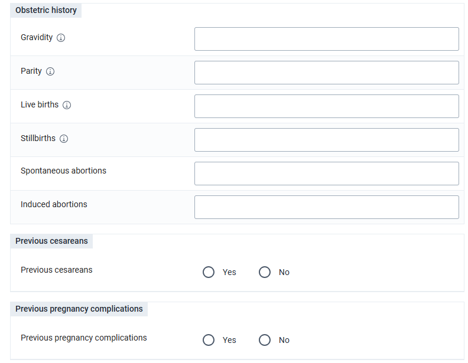

### Program stages

The **Maternal Death Case Review Tracker Program** is organized into a series of **program stages**, each representing a distinct phase in the review and documentation process. This structure mirrors the logical sequence of information collection used in the maternal death case review form, from the woman’s pregnancy and care pathway through to the identification of contributing factors and modifiable causes.

Each stage captures a specific set of information relevant to that phase of the maternal death, ensuring a clear and consistent workflow for data entry. The configuration allows users to progress through the stages in chronological order, reflecting the continuum of care and circumstances surrounding the event.

The stages are as follows:

1.  Pregnancy and Antenatal Care
2.  Pathway Before Admission
3.  Admission
4.  Labour and Birth
5.  Neonate
6.  Interventions
7.  Details of Death
8.  Critical Delays and Modifiable Factors

Within DHIS2, each of these program stages functions as a separate form, simplifying data entry and review. This modular structure enables data collectors and MPDSR committee members to focus on one dimension of the case at a time, improving completeness and data quality.

**Program rules** are used throughout the tracker to ensure logical data flow and contextual relevance. Depending on the information entered—such as the place of death or type of complication—additional fields or sections are automatically displayed to collect more detailed information. This dynamic approach minimizes errors, reduces unnecessary data entry, and ensures that the information recorded reflects the specific circumstances of each case.

The configuration also supports progressive documentation: information can be entered at different stages of the review process, allowing cases to be updated as more data become available. This facilitates an iterative, evidence-based review process that aligns with the MPDSR principle of continuous learning and accountability.

### Pregnancy and Antenatal care

The **Pregnancy and Antenatal Care** stage collects background information about the woman’s pregnancy, obstetric history, and the antenatal care received prior to the fatal event. This information establishes the clinical and social context of the case, enabling reviewers to assess maternal risk factors, preventive care, and access to essential services during pregnancy.

This stage is divided into several sections: **Obstetric history**, **Demographics**, **Type of pregnancy**, **Antenatal care**, **Pre-existing medical conditions**, **Antenatal risk factors**, **Antenatal hospitalization and medication**, **Laboratory tests**, and **Prophylaxis and vaccination**.

- **Obstetric history** records the woman’s reproductive background, including **gravidity**, **parity**, **number of live births**, **stillbirths**, **spontaneous and induced abortions**, and whether she had any **previous caesarean sections** or **pregnancy complications**.
- **Demographics** captures basic socio-demographic characteristics such as **age**, **education level**, and **marital status**, along with whether the woman was **using contraception prior to this pregnancy**.
- **Type of pregnancy** indicates whether the pregnancy was single or multiple, helping reviewers understand risk associated with multiple gestations.  
    **Antenatal care** records the **number of antenatal visits** completed, providing a measure of contact with health services during pregnancy.
- **Pre-existing medical conditions** captures chronic diseases or conditions such as **hypertension, diabetes, anaemia, hepatitis, heart disease, or syphilis**, with an open field for **other conditions**.
- **Antenatal risk factors** documents pregnancy-related risks identified during routine care, including **hypertension, proteinuria, glycosuria, anaemia, urinary tract infection, placenta praevia, malaria**, or **other conditions**.
- **Antenatal hospitalization and medication** sections indicate whether the woman was **hospitalized** during pregnancy and whether she **received antenatal medications**, offering insight into complications or preventive treatments provided.
- **Laboratory tests** records key antenatal investigations such as **blood group and Rh factor, haemoglobin or haematocrit levels, VDRL, rubella, and urinalysis**, with an option for **other tests** conducted.
- **Prophylaxis and vaccination** captures preventive interventions received during pregnancy, including **malaria prophylaxis, tetanus toxoid vaccination**, and screening for **HIV** and **tuberculosis**.

The **Pregnancy and Antenatal Care** stage ensures that all relevant background information on maternal health and antenatal service use is captured in a structured way. It provides the basis for identifying risk factors, evaluating the quality and continuity of antenatal care, and understanding the preventive opportunities that may have been missed.

#### Pathway Before Admission

The **Pathway Before Admission** stage documents the woman’s journey from the onset of symptoms to her arrival at the facility where care was received. It provides essential information on referral patterns, transport arrangements, and potential delays prior to admission.

This stage includes fields to indicate whether the **patient came on her own** or was **referred or evacuated** from another facility. When a referral is recorded, users can specify the **referring facility** through the organisational hierarchy, along with the **reason for referral or evacuation**.

Additional contextual information is collected on whether an **ambulance was used** for transport and whether the woman was **accompanied by another person** during the transfer. These details help assess the adequacy of referral systems and support mechanisms during emergency situations.

To better understand the sequence of events, users also enter the **date and time of symptom onset** and the **date and time of the referral or evacuation decision**. This allows the review committee to analyse the timeliness of recognition, referral, and access to care.

By systematically documenting these data, the **Pathway Before Admission** stage supports identification of barriers and delays in accessing emergency obstetric care and provides a basis for improving referral coordination and emergency transport systems within the MPDSR process.

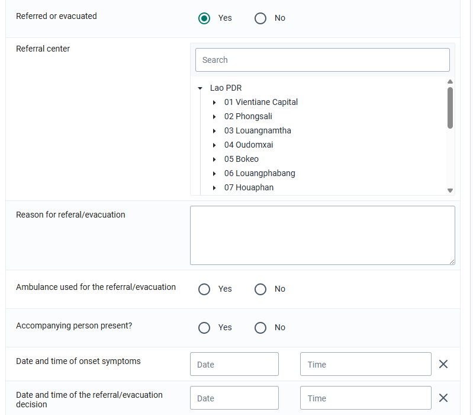

#### Admission

The **Admission** stage captures the woman’s clinical condition and key findings at the time she arrived at the facility where the maternal death occurred. It provides a baseline for understanding her health status on admission and the complications present at the start of care.

This stage is organized into four main sections: **Vital signs**, **Abdominal examination**, **Pelvic examination**, and **Complications**.

- **Vital signs** records the basic physiological parameters measured at admission, including **heart rate**, **blood pressure (systolic and diastolic)**, **temperature**, **respiratory rate**, **height**, and **weight**. These measurements help assess the woman’s stability and clinical condition upon arrival.
- **Abdominal examination** documents findings related to pregnancy and fetal assessment, including **fundal height**, **fetal heart sounds**, **fetal presentation**, and any **other relevant abdominal observations**.
- **Pelvic examination** captures information on the **stage of labour**, presence of **pelvic abnormalities**, and other findings that may influence labour management or delivery planning.
- **Complications** records the conditions identified at the time of admission, such as **premature rupture of membranes**, **pre-eclampsia**, **eclampsia**, **placental abruption**, **placenta praevia**, **premature labour**, **fetal demise**, **pyelonephritis**, **sepsis**, or **malaria**, with an open field for any **other complications** observed.

The **Admission** stage provides a comprehensive snapshot of the woman’s condition at the point of care, allowing reviewers to evaluate whether the presenting complications were recognized and managed appropriately. It supports analysis of the timeliness and accuracy of diagnosis, adequacy of triage, and readiness of the facility to provide emergency obstetric care.

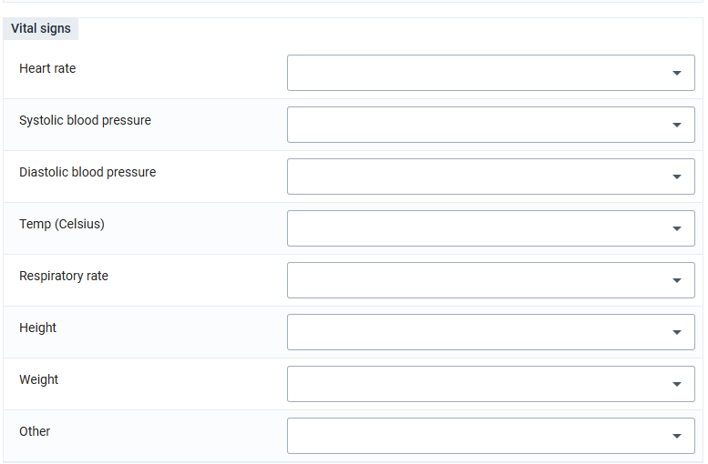

#### Labour and Birth

The **Labour and Birth** stage captures detailed information on the management of labour, delivery, and the immediate postpartum period for the woman who died. It provides the clinical context needed to understand the course of events surrounding childbirth, the care provided, and any complications encountered.

This stage is organized into thematic sections that follow the sequence of childbirth: **Labour assessment**, **Delivery process**, and **Postpartum complications**.

- **Labour assessment** records key information on the start and progression of labour, including whether the **last menstrual period (LMP)** was known and its date if available, the **gestational age** at birth and the **method of determination** (LMP or ultrasound), and the **date and time of birth**. It also captures the **place of birth**, **attendant at childbirth**, and whether a **partograph** was used to monitor progress. The **onset of labour**, **presence of fetal heart sounds**, and **labour complications** such as intrapartum haemorrhage, infection, pre-eclampsia/eclampsia, or obstructed labour are also documented.
- **Delivery process** captures the **mode of childbirth** (vaginal, assisted, caesarean section, etc.), the **time between decision for intervention and birth**, and the **management of the third stage of labour**, including whether **active management** was conducted and if there was a **retained placenta**.
- **Postpartum complications** records the presence of **haemorrhage**, **infection**, or **pre-eclampsia/eclampsia** following delivery, providing insight into the immediate maternal outcome after childbirth.

By consolidating these details, the **Labour and Birth** stage allows MPDSR reviewers to assess the quality and timeliness of intrapartum and postpartum care, identify complications, and evaluate whether standard obstetric practices were followed. The structured approach ensures comprehensive documentation of clinical management during one of the most critical phases of maternal care.

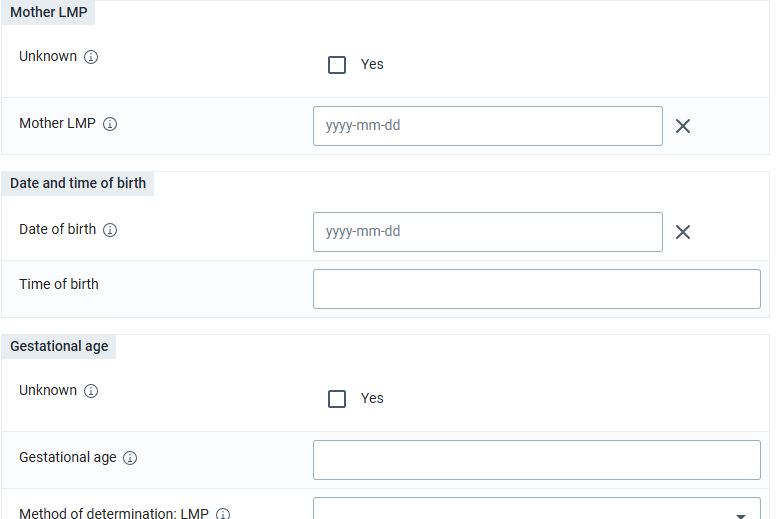

#### Neonate

The **Neonate** stage records information on the baby’s condition at birth and key characteristics that help assess the intrapartum and immediate postnatal outcome associated with the maternal death.

This stage is divided into three sections: **Neonate**, **Resuscitation**, and **Sex and Weight**.

- **Neonate:** captures the **Apgar score at 1 minute** and **Apgar score at 5 minutes**, providing an objective measure of the baby’s condition immediately after birth.
- **Resuscitation:** records whether **resuscitation was attempted** following delivery, allowing reviewers to assess the newborn’s need for emergency intervention and the timeliness of the response.
- **Sex and Weight:** captures the **sex of the baby** and the **birth weight (in grams)**, which are essential indicators for understanding neonatal outcomes and assessing potential risk factors such as prematurity or low birth weight.

The **Neonate** stage ensures that information on the baby’s condition and basic characteristics is consistently captured alongside the maternal case. These data help MPDSR committees evaluate the quality of intrapartum and immediate newborn care, and they contribute to identifying patterns of maternal and perinatal outcomes within the review process.

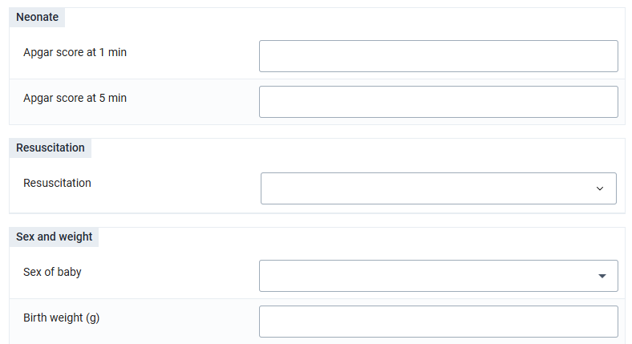

#### Interventions

The **Interventions** stage documents all major clinical procedures and treatments provided to the woman during her final episode of care. It is organized by phase of the reproductive process, allowing a clear record of what interventions were performed at each stage and supporting analysis of case management practices.

This stage is divided into five sections: **Early Pregnancy**, **Antepartum**, **Intrapartum**, **Postpartum**, and **Other**. Each section lists relevant procedures and treatments that can be selected to describe the care provided.

- **Early Pregnancy:** captures interventions such as _evacuation, laparotomy, hysterotomy, transfusion,_ and _other_ procedures performed before fetal viability.
- **Antepartum:** records management actions taken before the onset of labour, including _transfusion, version, induction of labour, administration of magnesium sulfate, antibiotics,_ and _other_ interventions.
- **Intrapartum:** documents procedures during labour and delivery, such as _symphysiotomy, hysterectomy, transfusion, magnesium sulfate, antibiotics, destructive operations,_ and _other_ intrapartum measures.  
    **Postpartum:** captures interventions after delivery, including _evacuation, laparotomy, hysterotomy, hysterectomy, transfusion, magnesium sulfate, antibiotics, oxytocin, misoprostol,_ and _other_ postpartum treatments.
- **Other:** records additional supportive or intensive care procedures, including _general anaesthesia, epidural, spinal or local anaesthesia, ICU ventilation, invasive monitoring,_ and _other_ interventions not captured above.

By structuring the data by phase, the **Interventions** stage allows reviewers to assess when and how key treatments were delivered and whether critical procedures—such as surgery, transfusion, or emergency pharmacologic interventions—were available and applied according to clinical protocols This information helps identify gaps in emergency response capacity, adherence to clinical protocols, and overall quality of obstetric and critical care services.

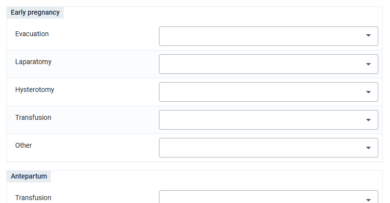

#### Details of Death

The **Details of Death** stage captures the outcome and immediate circumstances of the maternal death, providing closure to the clinical documentation before analysis and discussion by the review committee. It summarizes when and where the death occurred, the pregnancy outcome, and the main diagnosis or condition leading to death.

This stage records the **date and time of death**, along with the **place where the woman died**, such as in the facility, during transfer, at home, or elsewhere if referred. It also includes the **pregnancy outcome at the time of death**—whether the woman had delivered a live or stillborn baby, experienced an abortion, or remained undelivered—allowing reviewers to situate the event within the continuum of pregnancy, delivery, and postpartum care.

The stage captures the **final clinical diagnosis or cause of death** as determined by the attending team or the review committee. This information reflects the medical conclusion reached based on all available documentation and observations from earlier stages of the review process.

Where relevant, additional information may be recorded on whether the death was **certified**, and if supporting records—such as clinical notes, partographs, or referral documents—were available for review.

The **Details of Death** stage therefore completes the case documentation, consolidating the essential information required to understand the final outcome and ensuring that the case is accurately represented for analysis and discussion within the MPDSR process.

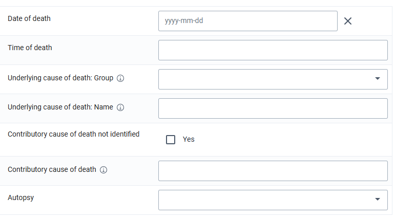

#### Critical Delays and Modifiable Factors

The **Critical Delays and Modifiable Factors** stage captures the review team’s assessment of where delays occurred in the woman’s pathway to receiving care, and the underlying factors that contributed to the outcome. It provides a structured framework for identifying points of failure and guiding corrective action within the MPDSR process.

This stage is divided into two main parts: **Critical Delays** and **Modifiable Factors**.

Under **Critical Delays**, reviewers assess whether the following delays contributed to the maternal death:

- **Delay 1:** Delay in recognizing the need for care — for example, the woman or family not identifying danger signs or deciding late to seek help.
- **Delay 2:** Delay in seeking care — for example, challenges in reaching a facility, arranging transport, or financial barriers.
- **Delay 3:** Delay in receiving adequate care — for example, delays in triage, unavailability of staff, equipment, blood, or timely clinical decision-making at the facility.

For each delay, users indicate whether it was present and can provide brief details on the circumstances contributing to it.

The **Modifiable Factors** section captures the role of preventable factors that contributed to the death. By identifying modifiable factors, the review aims to identify critical failures in the care seeking and provision process. These factors are grouped by category:

- **Family-related factors** (e.g. late recognition of complications, cultural or decision-making barriers),
- **Administration-related factors** (e.g. staffing shortages, lack of supplies, facility management issues),
- **Provider-related factors** (e.g. misdiagnosis, delayed intervention, non-adherence to protocols), and
- **Other factors** (e.g. external or contextual issues not covered above).

By combining the analysis of delays and modifiable factors, this stage helps the MPDSR committee identify where preventable barriers occurred and develop focused recommendations for improving service delivery, referral systems, and community awareness.

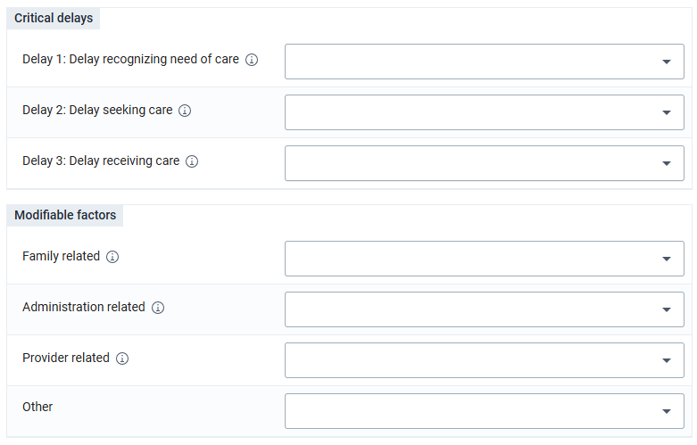

## Stillbirth and Neonatal Death Case Review Tracker Program

The Stillbirth and Neonatal Death Case Review Tracker Program is designed to systematically document, review, and analyse cases of stillbirth and neonatal death occurring in health facilities. It supports the implementation of national and global Maternal and Perinatal Death Surveillance and Response (MPDSR) strategies by enabling a standardized, digital process for case notification, investigation, and review within DHIS2.

This tracker facilitates the structured collection of information across the continuum of care—from maternal background and antenatal history to delivery, neonatal management, and postmortem findings—allowing review committees to identify contributing factors and propose corrective actions.

### Enrollment

The **Enrollment Section** initiates the _Stillbirth and Neonatal Death Case Review Tracker Program_ and establishes the key identifying information for each case. It links the mother and the baby to the facility context in which the event occurred and records any referral details associated with the case.

This section includes identifiers for both the **mother** and the **baby**, entered as a unique ID or full name, ensuring clear linkage between the maternal and newborn records. A **type of care available** field specifies the level of service at the reporting facility—such as _Comprehensive EmONC_, _Basic EmONC_, or _Primary care level_—which supports later analysis of outcomes by facility capability.

Referral details are also captured to trace the woman’s and baby’s care pathway. The user can indicate whether the case was **referred**, and if so, select the **referring facility** and the **facility the patient was referred to** in the health facility network. This information provides visibility on referral patterns and the flow of patients across the health system.

By capturing both identification and referral data at enrollment, this section ensures that each stillbirth or neonatal death case is uniquely recorded, correctly linked to the facility where it occurred, and associated with the appropriate level of care and referral pathway. Data on referral patterns are useful for all subsequent review and analysis stages within the MPDSR process.

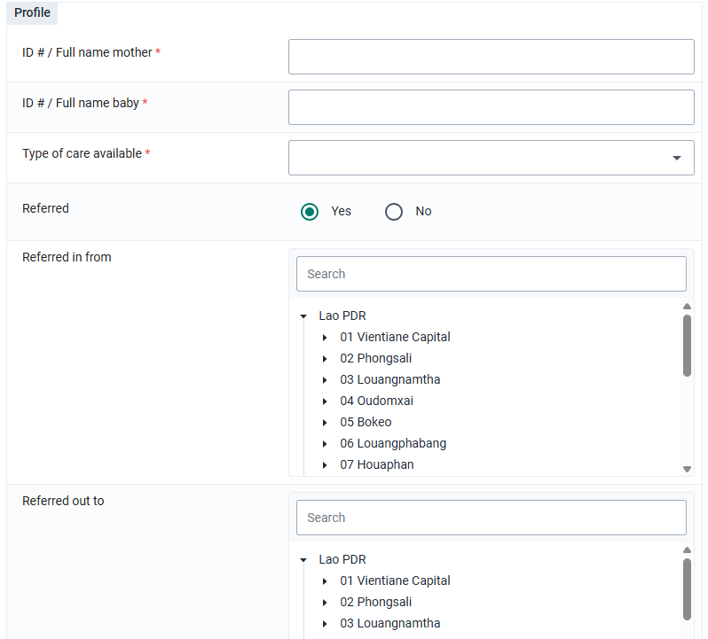

### Program Stages

The **Stillbirth and Neonatal Death Case Review Tracker Program** is structured into four sequential program stages that guide the systematic documentation and review of each case. The configuration mirrors the workflow of a perinatal death review process, capturing information from the mother’s pregnancy through to the circumstances of the baby’s death and the identification of contributing factors.

Each stage corresponds to a distinct part of the review form and focuses on a specific dimension of the case. The stages are designed to follow the natural chronology of events—beginning with pregnancy, followed by labour and delivery, and concluding with the review of the death and contributing factors.

Program rules are applied to control the display of fields depending on the information available (for instance, whether the baby was stillborn or born alive), ensuring that data entry remains efficient, relevant, and context-specific.

The stages included in this tracker are:

1.  **Pregnancy Progress and Care** – captures maternal background, pregnancy history, and antenatal care received.
2.  **Labour and Birth** – documents the circumstances, management, and outcomes of labour and delivery.
3.  **Details of Death** – records the timing, cause, and context of the stillbirth or neonatal death.
4.  **Critical Delays and Modifiable Factors** – identifies the contributing factors and delays leading to the outcome and outlines recommendations for corrective action.

This staged structure ensures that data are collected in a logical and comprehensive manner, supporting detailed review and analysis by facility and district MPDSR committees.

#### Pregnancy Progress and Care

The **Pregnancy Progress and Care** stage captures essential information about the mother’s obstetric history, demographic background, and the care received during pregnancy. It establishes the context in which the stillbirth or neonatal death occurred, identifies maternal risk factors and the quality of antenatal services provided.

This stage is divided into several sections: **Obstetric history**, **Demographics**, **Type of pregnancy**, **Antenatal care**, and **Prophylaxis and vaccination**.

- **Obstetric history** documents the woman’s reproductive background, including **gravidity**, **parity**, **number of live births**, **deaths**, **stillbirths**, **neonatal deaths**, and **abortions**. It also records whether she had any **previous caesarean sections** or **previous pregnancy complications**, with corresponding yes/no options.
- **Demographics** captures basic socio-demographic information such as the **mother’s age**, **education level**, and **marital status**, as well as whether the woman was **using contraception prior to this pregnancy**.
- **Type of pregnancy** indicates whether the current pregnancy was single or multiple, helping reviewers assess risk factors associated with multiple gestations.
- **Antenatal care** records the **number of antenatal visits** attended, reflecting contact with health services during pregnancy and opportunities for early detection of complications.
- **Prophylaxis and vaccination** captures information on preventive measures received during pregnancy, including **malaria prophylaxis**, **tetanus toxoid vaccination**, and results of **HIV** and **syphilis testing**.

By consolidating these data, the **Pregnancy Progress and Care** stage allows MPDSR committees to review the maternal background and antenatal care pathway leading up to the stillbirth or neonatal death. It supports the identification of risk factors, service delivery gaps, and missed opportunities for early intervention or prevention.

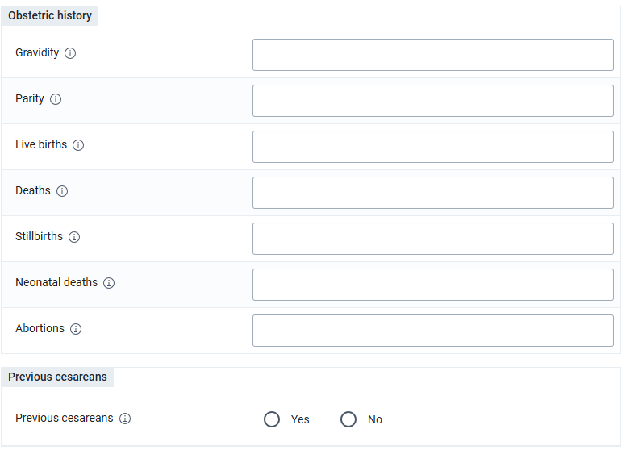

#### Labour and birth

The **Labour and Birth** stage records the key events and clinical information surrounding the woman’s labour, the delivery process, and the condition of the baby at birth. It provides the essential link between maternal care and newborn outcomes, allowing reviewers to assess the quality of intrapartum and immediate postnatal care.

This stage is structured into four sections: **Labour assessment**, **Delivery process**, **Gestational details**, and **Neonate**.

- **Gestational details** capture the timing and progression of the pregnancy at delivery, including whether the **last menstrual period (LMP)** was known and its date, the **gestational age** and **method of determination** (_LMP_ or _ultrasound_), and the **date and time of birth**.
- **Labour assessment** records the **place of birth**, **attendant at childbirth**, and indicators of labour monitoring and progression such as **onset of labour**, **presence of fetal heart sounds**, and **use of a partograph**.
- **Delivery process** includes details on the **mode of childbirth** (spontaneous, assisted, or caesarean), as well as the **time between decision for action and delivery**, reflecting the timeliness of obstetric response.
- **Neonate** captures the newborn’s condition at birth, including **Apgar scores at 1 and 5 minutes**, whether **resuscitation** was attempted, the **sex of the baby**, and the **birth weight** in grams.

The **Labour and Birth** stage provides a complete picture of intrapartum events and immediate neonatal status. This information enables MPDSR committees to assess the quality and timeliness of care during labour and delivery, identify potential causes of stillbirth or neonatal death, and determine whether appropriate interventions were undertaken.

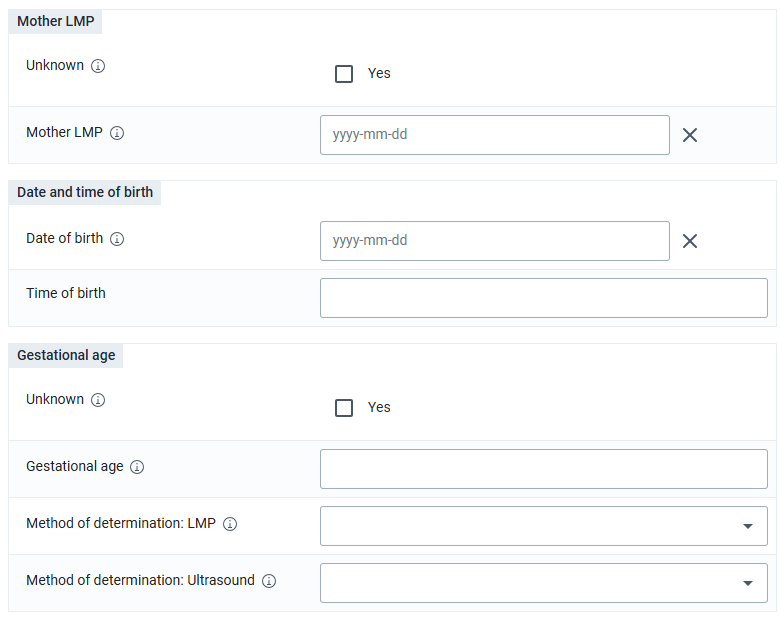

#### Details of death

The **Details of Death** stage captures key information about the timing, type, and underlying causes of the stillbirth or neonatal death. It provides the essential outcome data needed for analysis and classification within the MPDSR process.

This stage records the **date and time of death**, establishing the precise moment when the death occurred. It also specifies the **type of death**, distinguishing between stillbirth and neonatal death to support accurate categorization and reporting.

Information on the **main maternal condition** is also collected. The reviewer indicates whether a maternal condition was identified as contributing to the outcome, and if so, specifies the condition (for example, haemorrhage, eclampsia, infection, or obstructed labour). This field establishes the link between maternal complications and perinatal outcomes.

The **cause of death** field captures the immediate or most likely cause leading to the stillbirth or neonatal death, as determined through clinical review or committee assessment. Together, the cause and maternal condition provide the foundation for understanding the sequence of events that resulted in the death.

The **Details of Death** stage therefore consolidates critical outcome information, enabling systematic analysis of perinatal deaths and their association with maternal health status and intrapartum care. It forms a key component of the overall review and contributes to accurate mortality classification and trend monitoring within the MPDSR framework.

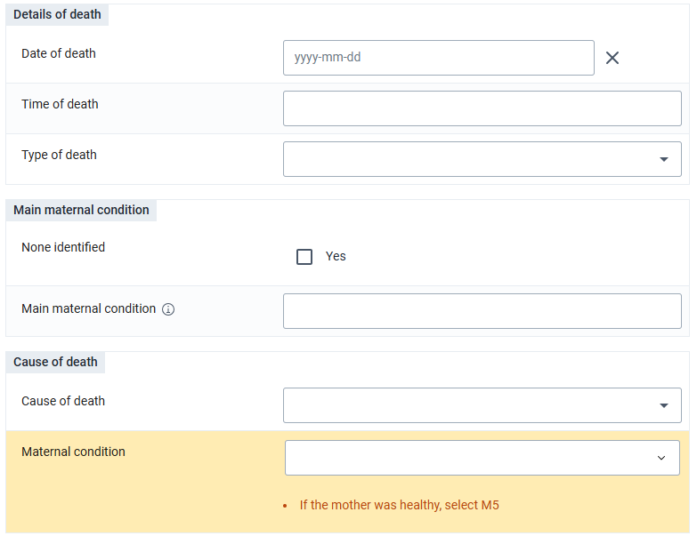

#### Critical delays and modifiable factors

The **Critical Delays and Modifiable Factors** stage captures the review team’s assessment of where delays occurred in the continuum of care and the contributing factors that may have led to the stillbirth or neonatal death. It provides a structured approach for analysing preventable elements and formulating recommendations for system improvement.

This stage is divided into two main sections: **Critical Delays** and **Modifiable Factors**.

- **Critical Delays** documents the presence of delays that may have contributed to the outcome, following the established MPDSR framework:  
    - **Delay 1:** Delay in the decision to seek care — for example, failure to recognize danger signs or late decision-making by the family.
    - **Delay 2:** Delay in reaching care — including transport difficulties, long travel distances, or financial constraints.
    - **Delay 3:** Delay in receiving adequate care — such as delayed triage, lack of essential supplies, unavailability of trained staff, or inadequate management at the facility.
- For each delay, reviewers indicate whether it was present and provide relevant details or observations.
- **Modifiable Factors** identifies the underlying contributors to the death that can be addressed to prevent similar cases in the future. These are grouped into categories:
    - **Family-related factors** (e.g., delays in care-seeking, decision-making, or social barriers);
    - **Administration-level factors** (e.g., staffing shortages, equipment failures, stock-outs, or management issues);
    - **Provider-level factors** (e.g., missed diagnosis, delayed treatment, or non-adherence to clinical protocols); and
    - **Other factors** not captured in the above categories.

By systematically documenting both delays and modifiable factors, this stage enables review committees to identify actionable insights and propose specific interventions to strengthen service delivery, referral mechanisms, and community awareness. The structured analysis ensures that each reviewed case contributes to continuous learning and improvement within the MPDSR process.

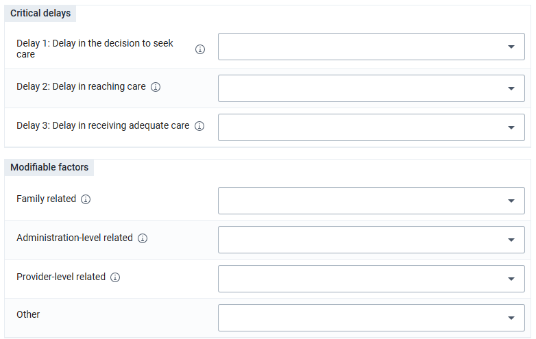

## MPDSR dashboards

### Health facility dashboards

The eleven visualizations in the Facility Dashboard allow health facility supervisors to monitor key indicators that can be generated from MPDSR tools. The first set of visualizations helps identify where facility-level delays and modifiable factors contributed to maternal and perinatal deaths, directing supervisors toward areas needing quality improvement or staff support. The following charts display patterns in the causes of maternal and perinatal deaths—both cumulatively and across quarters—helping supervisors detect emerging trends, monitor shifts in leading causes, and assess whether interventions are producing results. Visualizations that disaggregate perinatal deaths by period (antepartum, intrapartum, or neonatal) further highlight when along the care continuum deaths are most likely to occur, guiding targeted improvements in service delivery and emergency readiness. Finally, visualizations derived from the Situation Mapping Tool show whether essential MPDSR structures—such as review committees, notification, and certification processes—are in place and functioning. Taken together, these dashboards allow supervisors to link outcomes with system performance, track accountability actions, and continuously strengthen the quality and responsiveness of maternal and perinatal care.  

The first two visualizations provide the percent of reviewed maternal deaths and perinatal deaths in the past four quarters in which facility-related issues were identified. These include facility-level critical delays in care and administration or provider-level modifiable factors. These delays and factors are documented through the tracker programs and can be targeted through continuous learning, accountability, and quality improvement efforts.

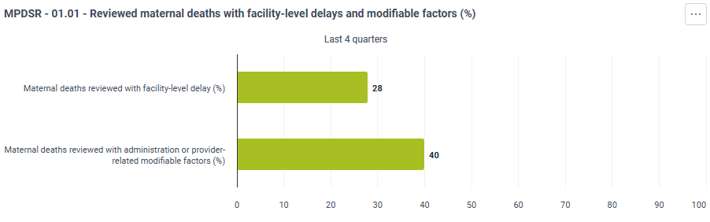

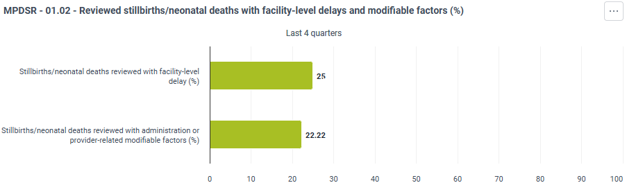

The next two visualizations provide the percent distributions of the causes of reviewed maternal deaths, cumulatively over the past four quarters and disaggregated by quarter. These visualizations present information gathered through the Details of Death section of the tracker program, and enable health facility supervisors to identify the distribution of direct and indirect maternal causes of death, as well as the proportion of deaths in which a cause could not be identified. The cumulative distribution presents causes of death from the highest to the lowest contributors over the past four quarters, whereas the disaggregated by quarter visualization shows causes in a static order so that changes over quarters can be identified.

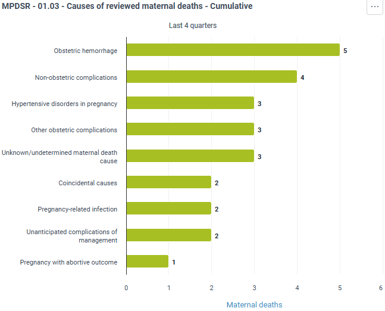

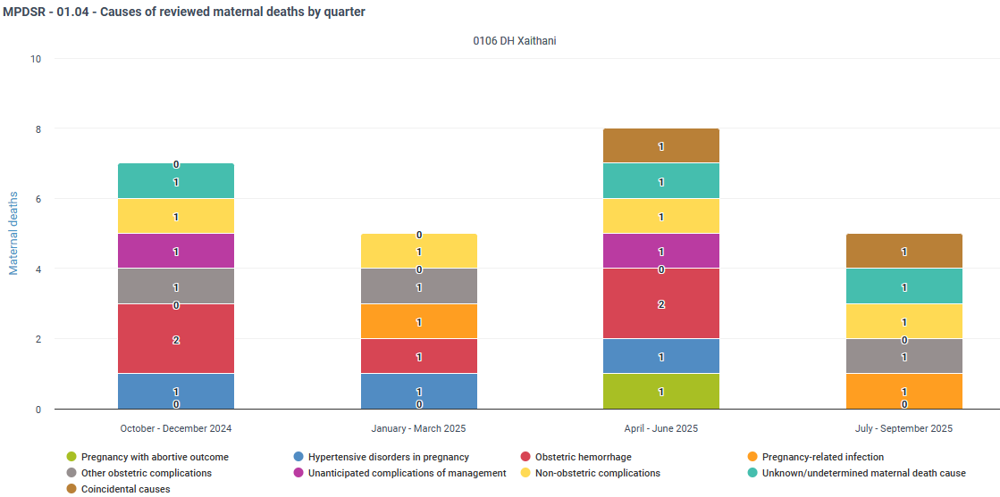

The next set of visualizations provides information on the causes of reviewed perinatal deaths, documented through the Details of Death stage of the tracker program. First, the percent distribution of causes of reviewed perinatal deaths across time periods (antenatal, intrapartum, and neonatal) is provided, disaggregated by quarter. This visualization presents causes in a static order so that changes over quarters can be identified. The next visualization provides the percent distribution of perinatal deaths by period over the past four quarters. In tandem with information on facility-level delays and modifiable factors, understanding the proportion of perinatal deaths that are intrapartum or neonatal provides crucial information for quality improvement efforts.

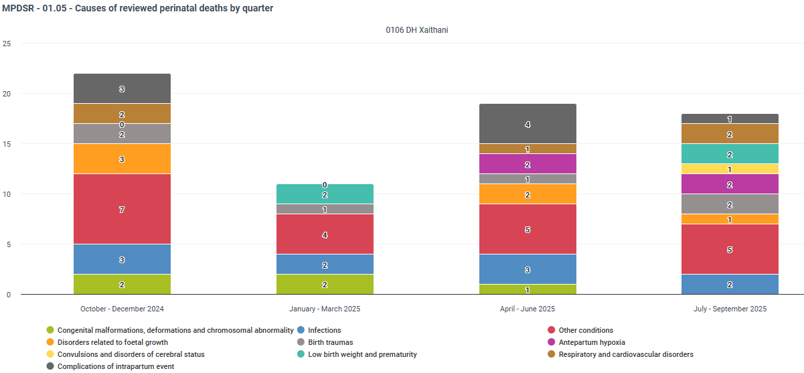

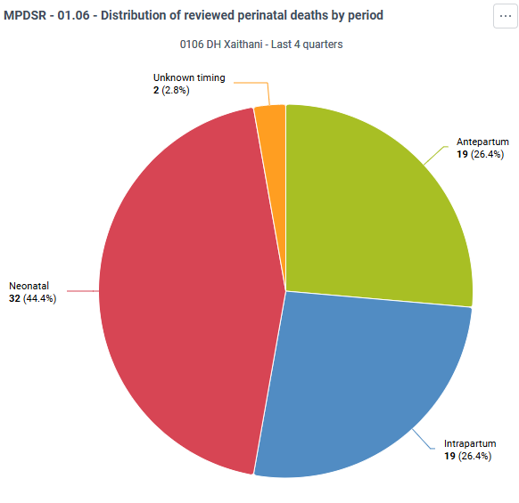

Following these summaries, the next three visualizations present the percent distribution of causes of perinatal deaths over the past four quarters for the antepartum, intrapartum, and neonatal periods, respectively. Causes are provided in order of their contribution to mortality in each period.

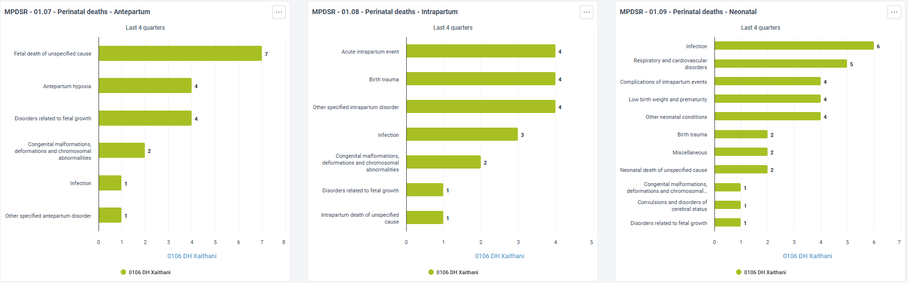

As MPDSR systems require multiple necessary elements to be in place at the health facility and administrative levels to contribute to quality improvement and accountability, the final two visualizations provide information on the operational status of these elements. The information captured through the most recent use of the Situation Mapping Tool is presented, first for the presence of key committees underlying MPDSR, and second for the presence of essential notification and certification processes.

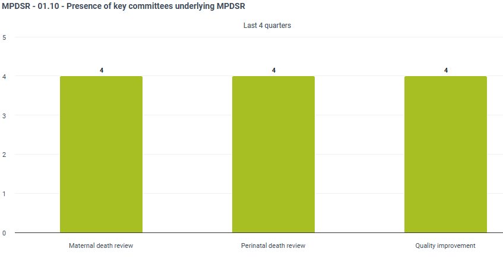

Together, these visualizations provide facility supervisors with the ability to monitor key indicators generated by the event and tracker programs in the MPDSR module, providing a snapshot of the past four quarters.

### Subnational/National dashboard

At the subnational and national levels, these visualizations transform facility-level data into a system-wide view of performance, enabling program managers to monitor progress, identify systemic gaps, and strengthen accountability across the health system.

The thirteen visualizations in the Subnational/National Dashboard provide higher-level users—such as provincial, district, or national program managers—with a comprehensive overview of performance and patterns gleaned from the MPDSR tools across facilities, enabling users to identify geographic or systemic trends in maternal and perinatal mortality and target areas requiring technical or policy attention. The first four visualizations help assess where critical delays and modifiable factors—at family, provider, or administrative levels—most frequently contribute to maternal and perinatal deaths, guiding resource allocation and capacity-building efforts. The next series of charts shows cumulative and quarterly cause-of-death distributions, allowing managers to track leading causes, detect shifts over time, and monitor progress in addressing specific causes of mortality. Visualizations on perinatal deaths, disaggregated by antepartum, intrapartum, and neonatal periods, pinpoint when along the care continuum deaths occur most often, helping identify whether interventions are needed in antenatal care, delivery management, or newborn care. Finally, visuals derived from the Situation Mapping Tool highlight system readiness by showing the proportion of facilities with functional committees relevant to MPDSR processes and with notification and certification mechanisms in place. Collectively, these visualizations enable subnational and national stakeholders to monitor quality issues, ensure accountability, and strengthen coordination and responsiveness within the MPDSR system.

The first two visualizations provide the percent of reviewed maternal deaths in the past four quarters in which any critical delays and modifiable factors were identified. The critical delays include recognizing the need for care, seeking care, and in receiving care. The modifiable factors include family-related, provider-related, and administration-related issues. Together, these visualizations help higher-level users understand where interventions may be needed at the community, facility, and systems levels.

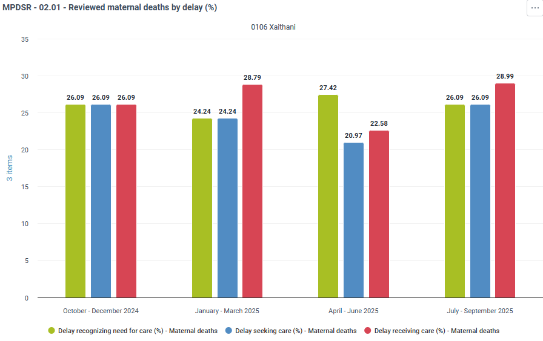

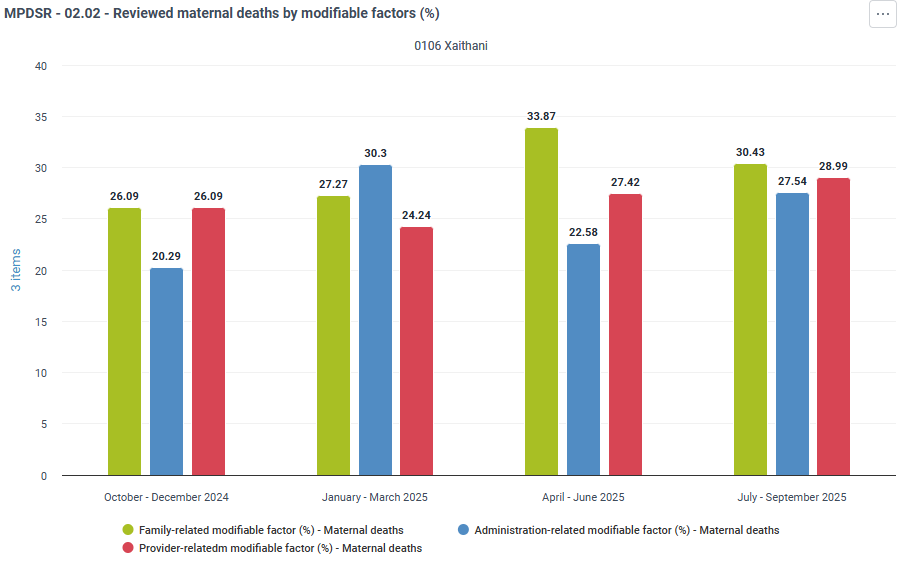

The next two visualizations provide similar information for reviewed perinatal deaths in the past four quarters.

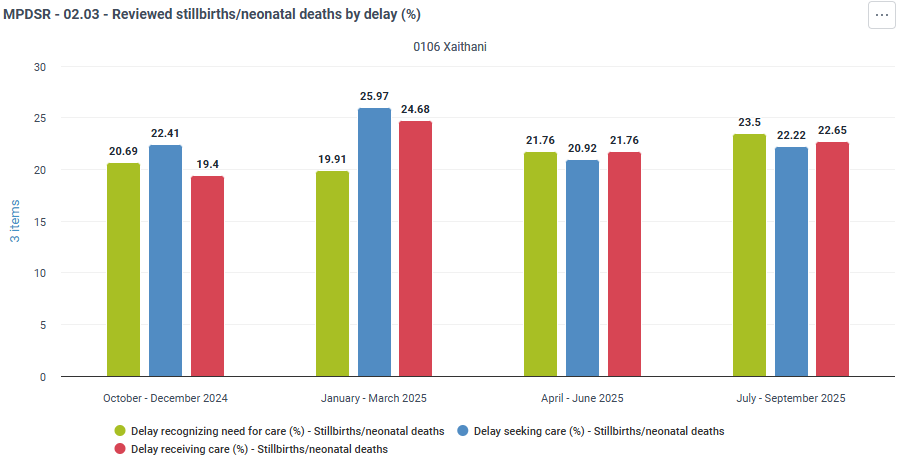

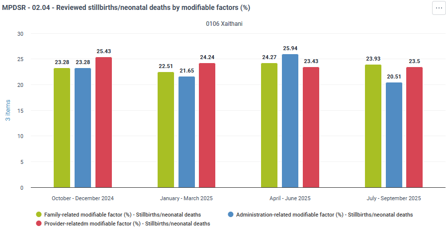

The next two visualizations provide the percent distributions of the causes of reviewed maternal deaths across facilities at the subnational or national level, both cumulatively over the past four quarters and disaggregated by quarter. These visualizations present information gathered through the Details of Death section of the tracker program, and enable higher-level users to identify the distribution of direct and indirect maternal causes of death, as well as the proportion of deaths in which a cause could not be identified. Similar to the Facility Dashboard, the cumulative distribution presents causes of death from the highest to the lowest contributors over the past four quarters, whereas the disaggregated by quarter visualization shows causes in a static order so that changes over quarters can be identified.

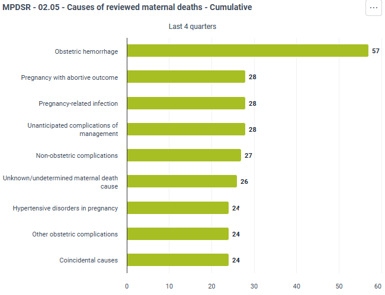

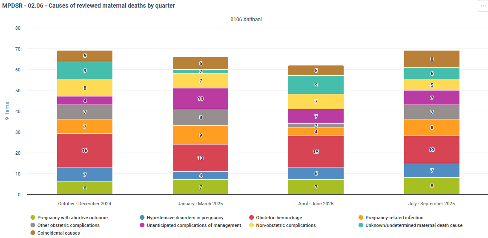

The next set of visualizations provides information on the causes of reviewed perinatal deaths across facilities in the selected area (subnational or national), documented through the Details of Death stage of the tracker program. First, the percent distribution of causes of reviewed perinatal deaths across facilities across time periods (antenatal, intrapartum, and neonatal) is provided, disaggregated by quarter. This visualization presents causes in a static order so that changes over quarters can be identified. The next visualization provides the percent distribution of perinatal deaths across facilities by period over the past four quarters.

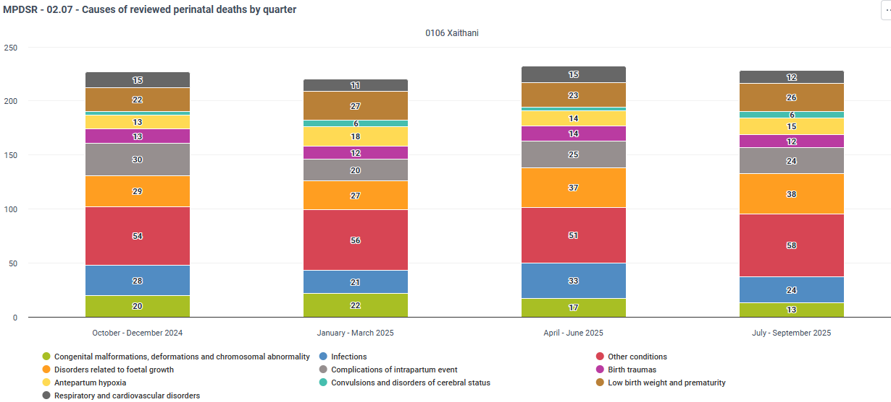

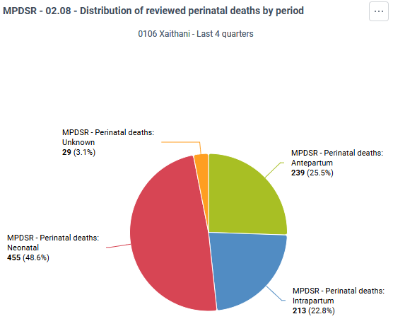

Following these summaries, the next three visualizations present the percent distribution of causes of perinatal deaths across facilities in the selected area (subnational or national) over the past four quarters for the antepartum, intrapartum, and neonatal periods, respectively. Causes are provided in order of their contribution to mortality in each period.

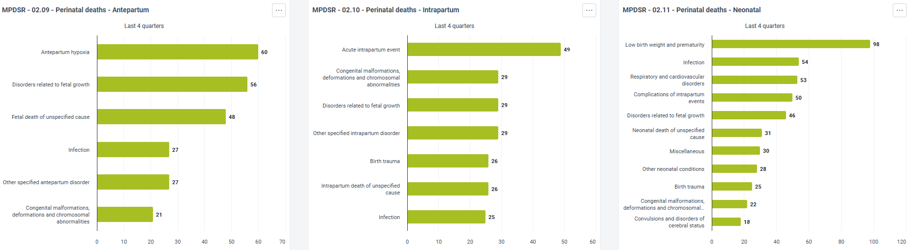

As MPDSR systems require multiple necessary elements to be in place at the health facility and administrative levels to contribute to quality improvement and accountability, the final two visualizations provide information on the operational status of these elements. These visuals provide the percent of facilities across the selected area (subnational or national) with key committees underlying MPDSR, and with essential notification and certification processes in place.

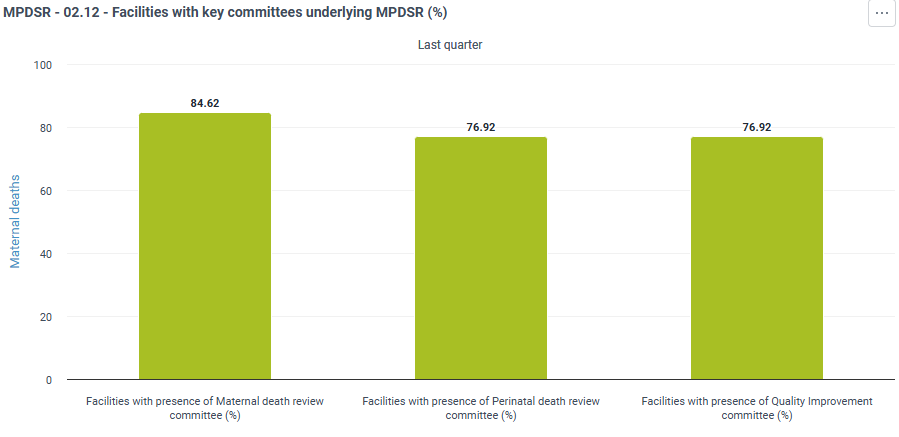

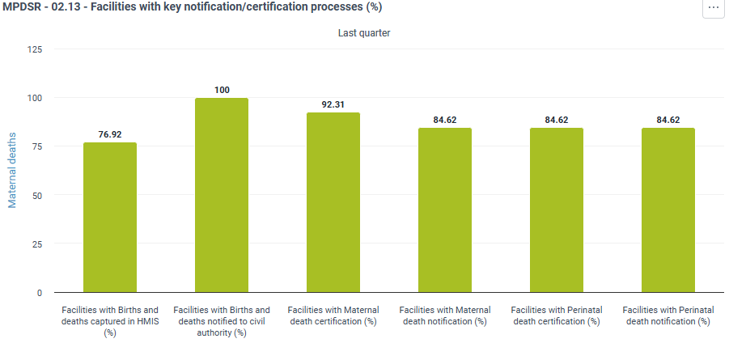

Together, these visualizations provide higher-level users the ability to monitor key indicators generated by the event and tracker programs in the MPDSR module, providing a snapshot of the past four quarters across facilities at the subnational or national level. Overall, the Subnational/National Dashboard provides a system-wide lens on MPDSR implementation, enabling decision-makers to translate data into coordinated action and policy-level accountability.

## User groups

| **User group** | **Metadata** | **Data** |
| --- | --- | --- |
| MPDSR - Admin | Can edit and view | No Access |
| MPDSR - Access | Can view only | Can view only |
| MPDSR - Data capture | Can view only | Can capture and view |
